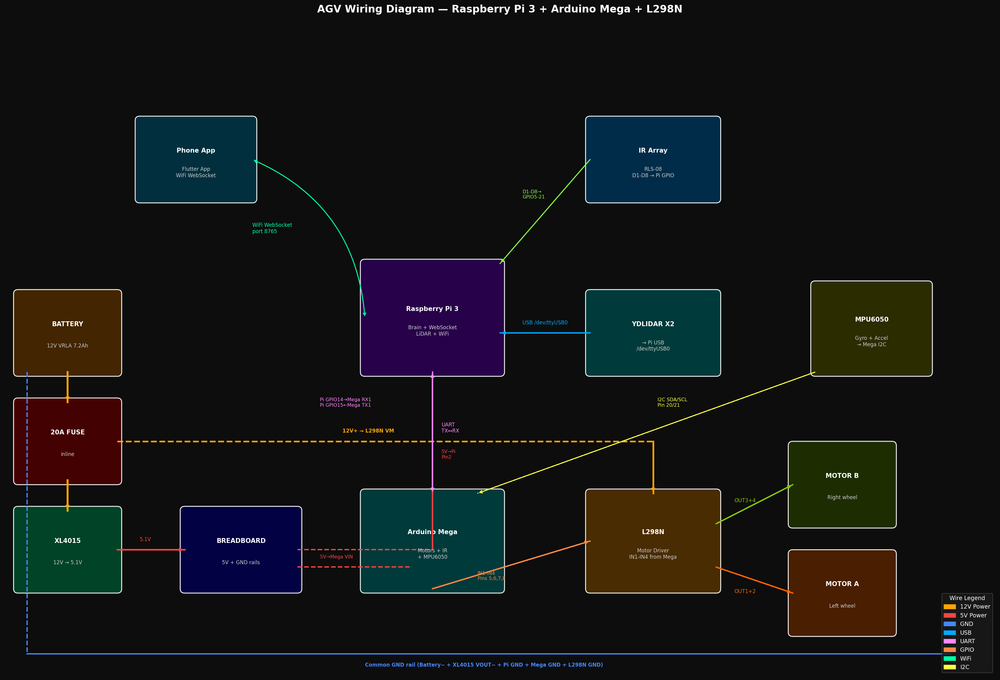

# AGV Raspberry Pi 3 + Arduino Mega Controller

A fully functional AGV prototype using Raspberry Pi 3 as the brain, Arduino Mega for sensor/motor control, YDLIDAR X2 for mapping and obstacle avoidance, IR array for line following, and a Flutter mobile app.

---

## Features

- Live LiDAR mapping (360° YDLIDAR X2)
- Manual control via Flutter app joystick
- Automatic obstacle avoidance using LiDAR
- Line following using IR array (RLS-08)
- MPU6050 gyroscope for heading control
- Real-time sensor data over WebSocket
- SSH remote access

---



## System Architecture

```
Flutter App (Phone)
        |
        | WiFi WebSocket (port 8765)
        ▼
Raspberry Pi 3 (Python AGV Server)
        |── USB ──> YDLIDAR X2 (/dev/ttyUSB0)
        |── UART ──> Arduino Mega (TX/RX)
        
Arduino Mega
        |── GPIO ──> L298N IN1-IN4
        |── I2C ──> MPU6050
        |── Digital ──> IR Array RLS-08 (D1-D8)

L298N Motor Driver
        |── OUT1/OUT2 ──> Motor A (Left)
        |── OUT3/OUT4 ──> Motor B (Right)
        |── 12V ──> Battery
```

---

## Hardware Components

| Component | Specification |
|---|---|
| Raspberry Pi 3 | Model B V1.2 |
| Arduino Mega | 2560 (motor + sensor controller) |
| LiDAR | YDLIDAR X2 (8m range, 360°) |
| Motor Driver | L298N Dual H-Bridge |
| Motors | 2x DC Geared Motors 6-12V |
| IR Array | RLS-08 (8 channel line sensor) |
| IMU | MPU6050 (accelerometer + gyro) |
| Battery | 12V VRLA 7.2Ah |
| Fuse | 20A inline fuse |
| DC-DC Converter | XL4015 Buck Converter (12V → 5.1V) |

---

## Wiring Connections

### Power Chain
```
Battery (+) ──> 20A Fuse ──> splits:
    Wire 1 ──> XL4015 VIN+ ──> VOUT+ 5.1V ──> Pi Pin2 + Mega VIN
    Wire 2 ──> L298N 12V terminal

Battery (−) ──> GND rail (all GNDs connected here)
```

### Pi → Arduino Mega UART
```
Pi GPIO14 (TXD, Pin8)  ──> Mega RX1 (Pin19)
Pi GPIO15 (RXD, Pin10) ──> Mega TX1 (Pin18)
Pi GND (Pin6)          ──> Mega GND
```

### Arduino Mega → L298N
```
Mega Pin 5  ──> L298N IN1
Mega Pin 6  ──> L298N IN2
Mega Pin 7  ──> L298N IN3
Mega Pin 8  ──> L298N IN4
ENA jumper ON
ENB jumper ON
```

### IR Array → Arduino Mega
```
IR D1 ──> Mega Pin 22
IR D2 ──> Mega Pin 23
IR D3 ──> Mega Pin 24
IR D4 ──> Mega Pin 25
IR D5 ──> Mega Pin 26
IR D6 ──> Mega Pin 27
IR D7 ──> Mega Pin 28
IR D8 ──> Mega Pin 29
IR VCC ──> 5V rail
IR GND ──> GND rail
```

### MPU6050 → Arduino Mega
```
MPU6050 VCC ──> 5V rail
MPU6050 GND ──> GND rail
MPU6050 SDA ──> Mega Pin 20 (SDA)
MPU6050 SCL ──> Mega Pin 21 (SCL)
```

### LiDAR → Pi
```
LiDAR Data USB  ──> Pi USB Port 1 (/dev/ttyUSB0)
LiDAR Power USB ──> Pi USB Port 2
```

---

## Software Setup

### Pi Setup
Flash Raspberry Pi OS Lite 32-bit using Raspberry Pi Imager.
Enable SSH and configure WiFi in imager settings.

```bash
# SSH into Pi
ssh pi@agv-pi.local

# Install dependencies
sudo apt install -y python3-serial python3-websockets python3-rpi.gpio

# Create AGV folder
mkdir -p /home/pi/agv

# Copy server files and run
cd /home/pi/agv
python3 agv_server.py
```

### Arduino Mega Firmware
Open firmware/mega/agv_mega/agv_mega.ino in Arduino IDE.
Select board: Arduino Mega 2560.
Upload.

### Flutter App
```bash
cd app
flutter pub get
flutter run
```
Enter Pi IP address in connect screen.

**📱 Download APK:** [](https://github.com/sandy001-kki/agv-raspberry-pi-mega/releases/download/v1.0.0/agv_controller.apk) or see [RELEASES.md](RELEASES.md) for more versions.

---

## Modes

| Mode | Description |
|---|---|
| Manual | Joystick control via app |
| Line Follow | IR array follows black line |
| Obstacle Avoid | LiDAR detects and avoids obstacles |

---

## File Structure

```
agv_pi_mega/
├── README.md
├── server/
│   └── raspberry_pi/
│       ├── agv_server.py       # Main WebSocket server
│       ├── motor_control.py    # Motor control via Mega UART
│       ├── ir_sensor.py        # IR array reader
│       └── lidar_reader.py     # LiDAR data parser
├── firmware/
│   ├── esp32/                  # ESP32 alternative firmware
│   └── mega/
│       └── agv_mega/
│           └── agv_mega.ino    # Arduino Mega firmware
├── app/
│   └── lib/
│       └── main.dart           # Flutter app
├── circuits/
│   └── wiring_diagram.md       # Complete wiring guide
└── docs/
    └── setup_guide.md          # Setup instructions
```

---

## Future Enhancements

- [ ] SLAM with Cartographer ROS2
- [ ] Nav2 navigation stack
- [ ] Path planning (A* / Dijkstra)
- [ ] Wheel encoders for odometry
- [ ] Camera + OpenCV object detection
- [ ] Multi-floor mapping
- [ ] Battery management system
- [ ] Warehouse automation mode
- [ ] ROS2 Humble integration
- [ ] Docker containerization

---

## Power Safety Rules

1. ONLY use 5V 2A charger for Pi — NEVER fast charger
2. Set XL4015 to exactly 5.1V before connecting Pi
3. Always insert 20A fuse before powering
4. Connect all GNDs to common rail before powering

---

## License

MIT License

---

## Author
Bollavaram Sandeep Kumar
---

AGV prototype project — Raspberry Pi 3 + Arduino Mega + YDLIDAR X2
